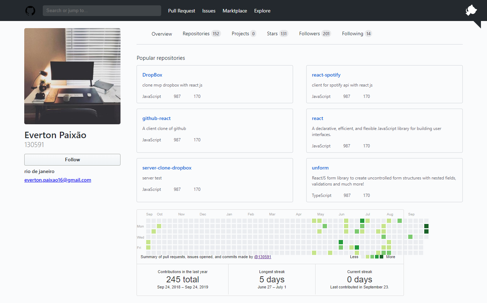
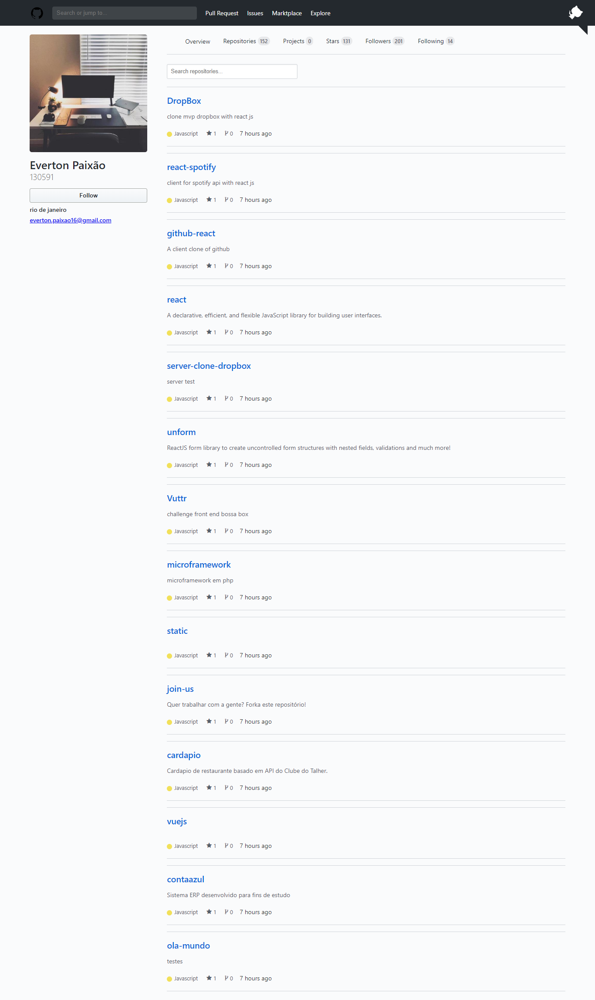
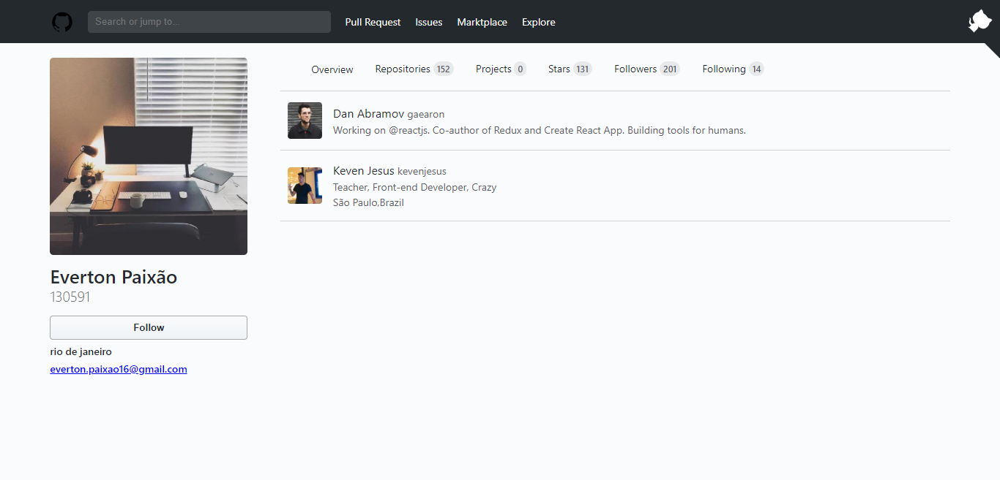

#React-Github
This is React-Spotify, a React front end client that communicates with the Github API with GraphQL.







## Guia de instalação

##Como instalar
Clone this repository:

```bash
git clone https://github.com/130591/react-github
```

Enter the folder and install the dependencies:

```bash
cd react-github && yarn install ou npm install
``` This is React-Github, a React front end client that communicates with the Github API.

## Contributing

Pull requests are welcome. For major changes, please open an issue first to discuss what you would like to change.

Please make sure to update tests as appropriate.

## License

[MIT](https://choosealicense.com/licenses/mit/)